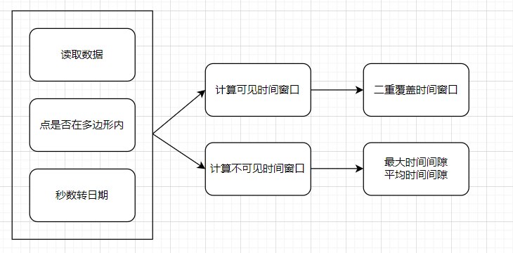
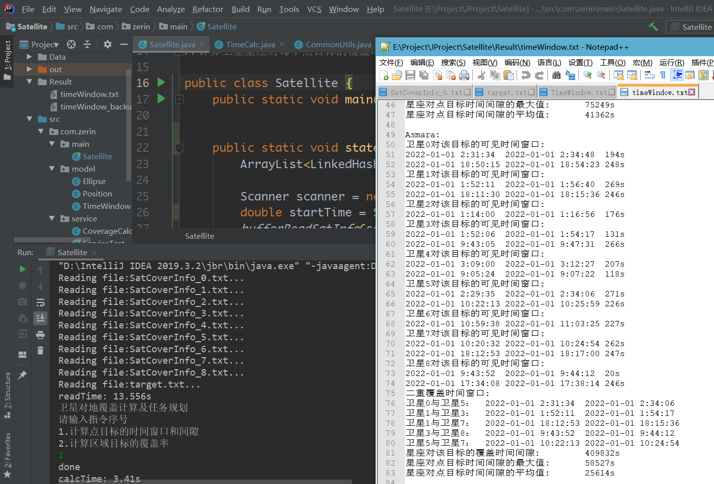
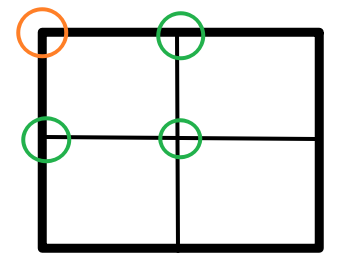

# **卫星对地覆盖计算及任务规划**

## 环境配置

Windows10	idea	Java  
jar包:lombok-1.18.16.jar	JUnit4

## 第一题

### 题目要求

1. 计算卫星星座对每个点目标的可见时间窗口，对每个点目标的二重覆盖时间窗口
2. 计算卫星星座对每个点目标的覆盖时间间隙，统计每个点目标时间间隙的最大值和平均值

### 概要设计

### 详细设计

#### 1.	读取数据

readSatInfo和bufferReadSatInfo方法

位于CommonUtils.java中，最初是用scanner读取，效率非常低，读取完整数据需要115s左右。后采用带缓冲的读取，速度提升了9倍，用时15s左右

#### 2.	判断点是否在多边形内

pointInPolygon方法

通过射线法：从需要判断的点向x轴负方向引一条射线，判断多边形的每一条边与这条射线的交点情况（此处是通过直线的点斜式方程求出交点X0），根据曲线乔丹定理：有奇数个交点时，点在多边形内，偶数个交点则不在。

也可以用第二题中先化为圆再判断的思路

#### 3.	秒数转日期

toDate方法

通过/和%运算

#### 4.	计算二重覆盖时间窗口

doubleTimeWindow方法

将存放所有时间窗口的集合进行遍历，分为3种情况，如下图，其中红色框代表前一个（第一层循环中的）时间窗口，黄色框代表后一个（第二层循环中的）时间窗口，ij代表该时间窗口的起始时间和结束时间，时间复杂度为O（n2）

#### 5.	计算覆盖时间间隙

gapTimeWindow方法

传入的参数为：单颗卫星对单个点目标的最大时间间隙和所有时间间隙集合，所有卫星对单个点目标的时间间隙集合

#### 6.	计算完整第一题的方法

timeWindowCalculate方法

通过4个for循环，遍历每个点目标和卫星，中间调用前面介绍的方法得到第一题结果

### 运行情况

## 第二题

### 题目要求

1. 计算每个时刻的瞬时覆盖率，并将结果绘制成曲线
2. 对于仿真周期内的某个时刻，将该时刻区域内被覆盖的网格，不被覆盖的网格，不确定的网格用不同的颜色绘制出来
3. 将不同时刻的覆盖率结果，以动态形式展现出来（即添加时间，能够对时间进行调整，让时间流动）需要计算的地面区域目标数据为：一个经纬度矩形范围 经度区间为75°E-135°E，纬度区间为 0°N-55°N
4. 对于不确定的网格，我们可以将网格一分为四，然后判断新的网格是否会被卫星覆盖，直到不确定的网格面积之和与总面积之比小于 0.1%停止

### 概要设计

先将每秒的block信息初始化放在allBlocks中, 对于某卫星的某秒, 对allBlocks中的网格进行判断, 能确定的网格加入到面积中, 不能确定的记录表格坐标, 暂时将其放入数组中;同时将不能确定的表格分成4个,放到新网格中

待这一秒判断结束(满足不确定的网格面积之和与总面积之比小于 0.1%)时,对allBlocks进行两个操作:修改数组中对应网格的边长;加入新网格中存放的分化的那些表格

### 详细设计

#### 1. 多边形转圆

toEllipse方法

将卫星数据由每秒的21行数据转化为每秒一个圆,减少计算量
取第1个数据和第11个数据,以这两个点之间的线段为直径,发现圆的
半径为常量7.0068,若直接赋值给半径变量,可节省零点几秒,但失去了普适性

#### 2.判断点是否在圆内

pointInCircle方法

将点与圆心距离与半径进行比较

#### 3.对不确定的block进行再划分

reDivision方法

由原来已知的一个点(左上角 橘)和边长 得到新的3个点(绿) 从而完成划分

#### 4.对球面面积的计算

R地球半径

Longitude经度

Latitude纬度  
$$
S=R^2(lat_2-lat_1)*(\sin lat_2-\sin lat_1)
$$

$$S=R^2(lat_2-lat_1)*(\sin lat_2-\sin lat_1)$$

## todo

第一题的计算过程应该和输出过程分离，而不是挤在一个函数里

C++的读取文件经过缓冲优化之后变快不少,但是将缓存中的数据赋值过程很慢
readme+=12题的主要函数的 for循环逻辑

## 参考

https://www.cnblogs.com/luxiaoxun/p/3722358.html

https://wenku.baidu.com/view/a9def74633687e21af45a997.html
