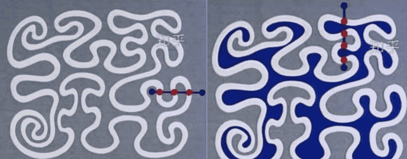

# **卫星对地覆盖计算及任务规划**

## 第一题

### 题目要求

1.计算卫星星座对每个点目标的可见时间窗口，对每个点目标的二重覆盖时间窗口。

2.计算卫星星座对每个点目标的覆盖时间间隙，统计每个点目标时间间隙的最大值和平均值。

### 概要设计

### 详细设计

#### 1.	读取数据

readSatInfo和bufferReadSatInfo方法

位于CommonUtils.java中，最初是用scanner读取，效率非常低，读取完整数据需要115s左右。后采用带缓冲的读取，速度提升了9倍，用时15s左右

#### 2.	判断点是否在多边形内

pointInPolygon方法

通过射线法：从需要判断的点向x轴负方向引一条射线，判断多边形的每一条边与这条射线的交点情况（此处是通过直线的点斜式方程求出交点X0），根据曲线乔丹定理：有奇数个交点时，点在多边形内，偶数个交点则不在。

#### 3.	秒数转日期

toDate方法

通过/和%运算

#### 4.	计算二重覆盖时间窗口

doubleTimeWindow方法

将存放所有时间窗口的集合进行遍历，分为3种情况，如下图，其中红色框代表前一个（第一层循环中的）时间窗口，黄色框代表后一个（第二层循环中的）时间窗口，ij代表该时间窗口的起始时间和结束时间，时间复杂度为O（n2）

#### 5.	计算覆盖时间间隙

gapTimeWindow方法

传入的参数为：单颗卫星对单个点目标的最大时间间隙和所有时间间隙集合，所有卫星对单个点目标的时间间隙集合

#### 6.	计算完整第一题的方法

通过4个for循环，遍历每个点目标和卫星，中间调用前面介绍的方法得到第一题结果

### 运行情况

## 参考

https://www.cnblogs.com/luxiaoxun/p/3722358.html
